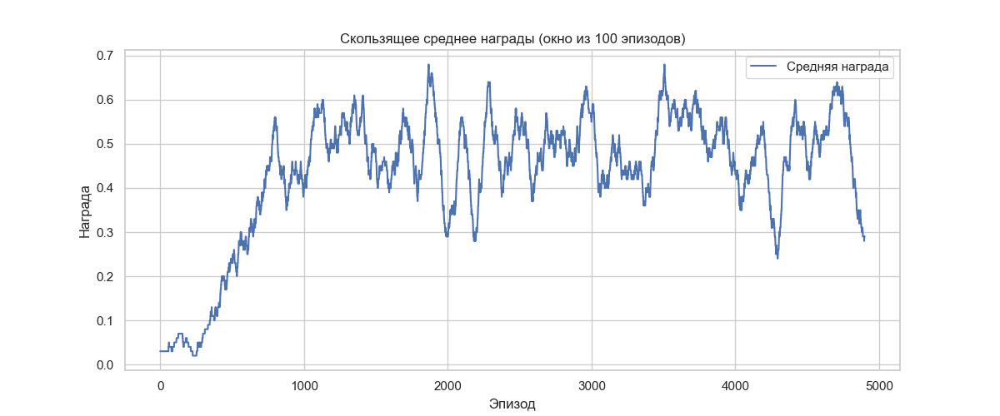
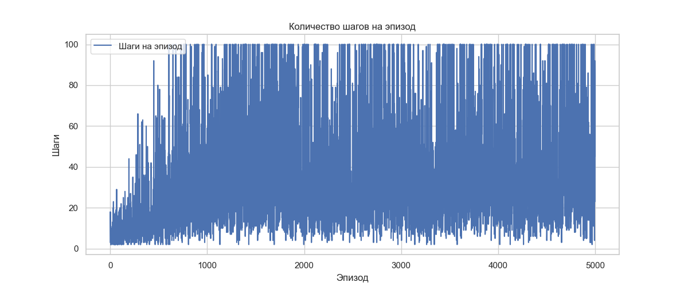
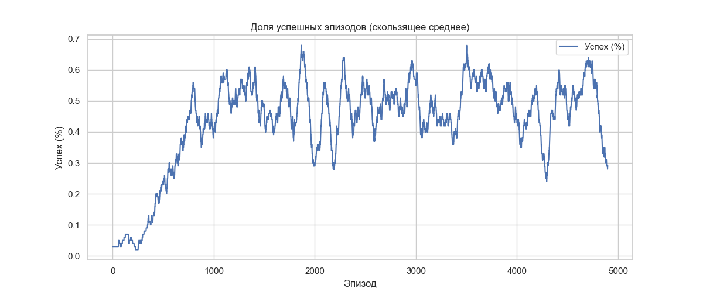

# Отчёт: Обучение агента методом Q-Learning на среде FrozenLake-v1

## 1. Цель
Обучить агента проходить ледяной лабиринт (FrozenLake-v1) с помощью алгоритма Q-Learning.

## 2. Среда
- **Название**: FrozenLake-v1  
- **Характеристики**:
  - Состояний: 16  
  - Действий: 4 (влево, вниз, вправо, вверх)  
  - Награда за успешное завершение: +1  
  - Стохастическая среда (агент может "соскользнуть" при действии)

## 3. Параметры обучения
- **Количество эпизодов**: 5000  
- **Гиперпараметры**:
  - `alpha` (скорость обучения): 0.8  
  - `gamma` (дисконтирование): 0.95  
  - `epsilon` (начальная вероятность случайного действия): 1.0  
  - Уменьшение `epsilon`: `epsilon = max(0.01, epsilon * 0.995)`

## 4. Результаты обучения

### 4.1 Скользящее среднее награды
На графике показано скользящее среднее награды за последние 100 эпизодов:

- **Тенденция**: Агент постепенно улучшает свои навыки.  
- **Достижение**: К концу обучения средняя награда достигает около **0.6**, что указывает на успешное прохождение лабиринта.

### 4.2 Количество шагов на эпизод
На графике показано количество шагов, которые агент делает в каждом эпизоде:

- **Тенденция**: В начале обучения агент совершает много случайных шагов, но со временем становится более эффективным.  
- **Результат**: К концу обучения среднее количество шагов стабилизируется около **70–80**, что говорит о том, что агент научился находить оптимальный путь.

### 4.3 Примеры прогресса

| Эпизод | Средняя награда |
| ------ | --------------- |
| 100    | 0.03            |
| 500    | 0.13            |
| 1000   | 0.40            |
| 2000   | 0.62            |
| 3000   | 0.54            |
| 4000   | 0.56            |

## 5. Анализ результатов

### Успехи
- **Стабильный рост производительности**:
  - За первые 1000 эпизодов агент значительно увеличил свою среднюю награду.
  - После 2000 эпизодов средняя награда достигла высокого уровня (~0.6).
- **Эффективность действий**:
  - Количество шагов на эпизод сократилось с ~100 до ~70–80, что указывает на то, что агент стал лучше ориентироваться в среде.

### Проблемы
- **Стохастичность среды**:
  - Из-за случайных переходов агент иногда теряет путь, что приводит к колебаниям в наградах.
- **Неустойчивость в конце обучения**:
  - После достижения высокой производительности (эпизод ~2000) наблюдается некоторая нестабильность — возможно, из-за случайных ошибок или недостаточной эксплуатации.

## Возможные улучшения
- Использование ε-greedy с более медленным уменьшением `epsilon`  
- Добавление дополнительных фичей:
  - Например, использование **Softmax Exploration** вместо жёсткого ε-greedy.
- Использование **double Q-learning** для снижения переоценки действий.
- Увеличение количества эпизодов:
  - Более длительное обучение может помочь агенту лучше адаптироваться к стохастичности среды.

## 6. Заключение
Агент успешно обучился проходить лабиринт **FrozenLake-v1** методом **Q-Learning**. Хотя наблюдаются некоторые колебания в производительности из-за стохастичности среды, общая тенденция положительная. Для дальнейшего улучшения можно попробовать вышеописанные модификации.

## 7. Выводы
- **Q-Learning** хорошо подходит для задач с дискретными состояниями и действиями.  
- Стохастичность среды требует большего времени обучения и грамотного баланса между исследованием и эксплуатацией.  
- Графики наград и шагов помогают понять динамику обучения и выявить проблемы.

